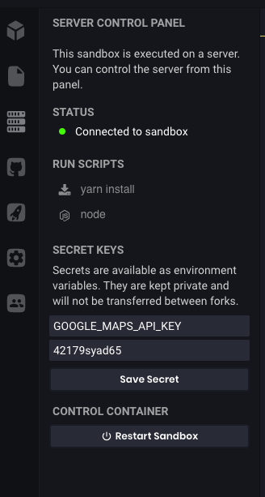
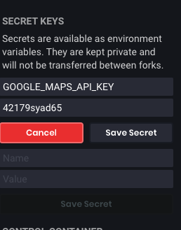

## What are secrets?

Secrets are used to hide sensitive information in your application that you don't want the world to see, and are implemented in CodeSandbox using environment variables.
The most common use case for using secrets is with API keys.

Secrets values will not be transferred between forks and **can only be used in container sandboxes**.

## Adding secrets in CodeSandbox

You can control the secrets in your Server Control Panel, before adding any it should look like this:


Let's say you want to add a Google Maps API key. You can do it like so:



Pro tip: It's always a good practice to name your secrets all in uppercase.

After clicking add secret you will a list of all your secrets above the form.


As said earlier, secrets are environment variables, meaning they are defined on `process.env`. In the example above, we can read the API key from `process.env.GOOGLE_MAPS_API_KEY`.

Like so:

```js
var http = require('http');

const key = process.env.GOOGLE_MAPS_API_KEY;

http
  .createServer(function(req, res) {
    res.write('This your maps key' + key);
    res.end(); //end the response
  })
  .listen(8080);
```

The sandbox used is [https://codesandbox.io/s/2v6xq474kj](https://codesandbox.io/s/2v6xq474kj)

## Editing secrets in CodeSandbox

Our UI also gives you the option to edit or even remove a secret, by hovering the secret you want to edit you will see these two icons:


If you click on the pencil you will see it will turn into a form again where you can edit the name and value of your secret:



This will take effect automatically and it will also restart your sandbox to make sure we use the new value.

To delete you can click on the `x` icon after the pencil one and this one will also restart your sandbox.
