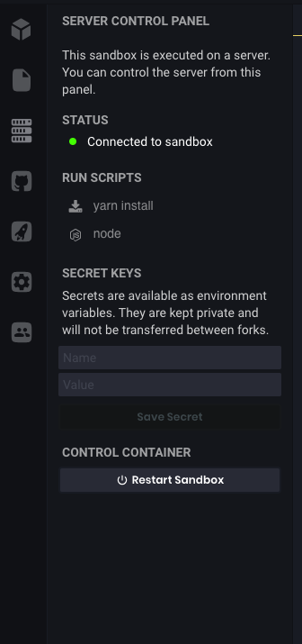
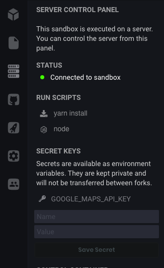
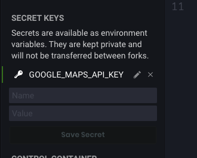

## What are secrets?

Secrets are also known as enviroment variables are used to hide sensitive information in your application that you don't want the world to see.
The most common example for the usage is with API keys.

These secrets will not be transferred between forks and **can only be used in container sandboxes**

## How add secrets in CodeSandbox

You can control the secrets in your server control panel and before adding any it should look like this:



Let's say you wanna add a google maps api key. You can do it like so:


It's always a good practice to name your secrets all in uppercase.

After clicking add secret you will a list of all your secrets above the form.



To use them in your code you use `process.env` and the name of your secret so in the case I call `process.env.GOOGLE_MAPS_API_KEY` and it will return me the value.

Like so:

```js
var http = require('http');

const key = process.env.GOOGLE_MAPS_API_KEY;

http
  .createServer(function(req, res) {
    res.write('This your maps key' + key);
    res.end(); //end the response
  })
  .listen(8080);
```

The sandbox used is [https://codesandbox.io/s/2v6xq474kj](https://codesandbox.io/s/2v6xq474kj)

## How edit secrets in CodeSandbox

Our UI also gives you the option to edit or even remove a secret, by hovering the secret you want to edit you will see these two icons:



If you click on the pencil you will see it will turn into a form again where you can edit the name and value of your secret:


This will take effect automatically and it will also restart your sandbox to make sure we use the new value.

To delete you can click on the `x` icon after the pencil one and this one will also restart your sandbox.
